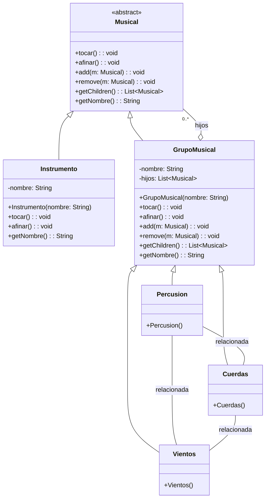

# README — Diagrama UML (Composite) en Mermaid

A continuación se incluye **exactamente** el prompt que solicitaste y, después, el código Mermaid que dibuja el diagrama de clases UML para el patrón Composite aplicado a un sistema musical. Guarda este archivo como `README.md` en la raíz de tu repositorio y GitHub renderizará el diagrama directamente (GitHub soporta bloques Mermaid en Markdown).

---

## Prompt original (tal cual)

```
Genera un diagrama de clases UML en formato mermaid para el patrón Composite aplicado a un sistema musical. Detalles del diseño: Clase abstracta Musical con métodos: tocar(): void afinar(): void add(m: Musical) remove(m: Musical) getChildren(): List getNombre(): String Clase concreta Instrumento (hoja) que hereda de Musical. Atributo: nombre: String Implementa tocar(), afinar() y getNombre() Clase GrupoMusical (composite) que también hereda de Musical. Atributos: nombre: String, hijos: List Métodos: tocar(), afinar(), add(), remove(), getChildren(), getNombre() Clases concretas que heredan de GrupoMusical: Percusion (constructor crea instrumentos de percusión como Batería, Congas, Bongós) Cuerdas (constructor crea instrumentos de cuerdas como Guitarra, Violín, Arpa) Vientos (constructor crea instrumentos de viento como Flauta, Saxofón, Trompeta) Relaciona Musical como la superclase abstracta de Instrumento y GrupoMusical, y luego GrupoMusical como padre de Percusion, Cuerdas y Vientos. Las clases percusion cuerdas y vientos deben de estar relacionadas entre si, la clase grupomusical debe de tener una relacion de agregacion con la clase musical, la clase instrumento una herencia con musical y las clases percusion cuerdas y vientos, herencia con grupo musica

m,andame el archuivo read me, donde salga este mismo prompt primero y que el codigo que me pases dibuje el diagrama en el github
```

---

## Diagrama de clases UML (Mermaid)

Copia el bloque siguiente directamente en tu `README.md` o en cualquier archivo `.md` dentro de tu repo en GitHub para que se muestre el diagrama:



---

## Cómo usar

1. Crea un nuevo repositorio o usa uno existente.
2. Coloca este `README.md` en la raíz del repositorio.
3. Haz commit y push al repositorio en GitHub.
4. Abre la página del repositorio en GitHub: el bloque `mermaid` se renderizará y verás el diagrama.

> Nota: Si tu cuenta/org tiene la vista de Mermaid deshabilitada o si GitHub cambia el soporte por defecto, puedes usar una extensión del navegador que renderice Mermaid en Markdown o generar una imagen con una herramienta local y añadirla al repo.

---

Si quieres, también puedo:

* Generar un archivo separado `diagram.mmd` con sólo el bloque Mermaid.
* Proveer el código Java de ejemplo que implementa estas clases.
* Exportar el diagrama como imagen SVG/PNG lista para subir al repo.

Dime qué prefieres y lo preparo.
